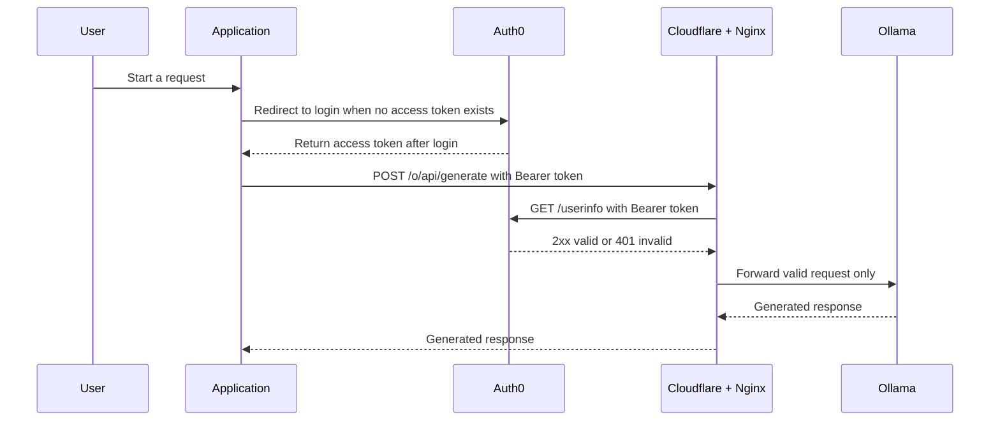

# Ollama Gateway


```sh
ssh -A tuanta7@192.168.1.37
make run
```

## Quick Links

- Available models: [Ollama Library](https://ollama.com/library)
- Auth0 instance: [jp/tuanta7](https://manage.auth0.com/dashboard/jp/tuanta7/users)
- Homebrew: [Releases](https://github.com/Homebrew/brew/releases)
- Clouflare: [Tunnel](https://dash.cloudflare.com/dd1a431d1dc8a74c5a2083262e2668b2/tunnels/3a4e432b-0721-4f59-a6b9-4568580823e7/overview)

## Authentication Flow



The application handles the Auth0 login redirect and obtains the access token using its Auth0 client ID. Nginx does not redirect API clients: it returns `401 Unauthorized` when the `Authorization: Bearer <token>` header is missing or invalid.

## Brew Script

If the brew installation script fails, try using curl manually to download the .pkg installer, and then proceed with the installation.

```sh
curl -L -O https://github.com/Homebrew/brew/releases/download/6.0.17/Homebrew.pkg
sudo installer -pkg /path/to/Homebrew.pkg -target /
```
